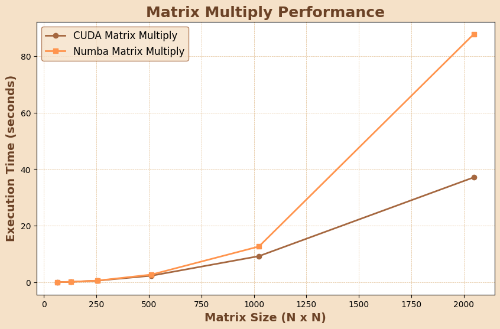

# MiniTorch Module 3


* Docs: https://minitorch.github.io/
* Overview: https://minitorch.github.io/module3.html

You will need to modify `tensor_functions.py` slightly in this assignment.

* Tests:

```
python run_tests.py
```

* Note:

Several of the tests for this assignment will only run if you are on a GPU machine and will not
run on github's test infrastructure. Please follow the instructions to setup up a colab machine
to run these tests.

This assignment requires the following files from the previous assignments. You can get these by running

```bash
python sync_previous_module.py previous-module-dir current-module-dir
```

The files that will be synced are:

    minitorch/tensor_data.py minitorch/tensor_functions.py minitorch/tensor_ops.py minitorch/operators.py minitorch/scalar.py minitorch/scalar_functions.py minitorch/module.py minitorch/autodiff.py minitorch/module.py project/run_manual.py project/run_scalar.py project/run_tensor.py minitorch/operators.py minitorch/module.py minitorch/autodiff.py minitorch/tensor.py minitorch/datasets.py minitorch/testing.py minitorch/optim.py

# 3.1 - Basic Fast Ops

```
sum in tensor_functions.py
MAP
 
================================================================================
 Parallel Accelerator Optimizing:  Function tensor_map.<locals>._map, /Users/dyl
anriffle/Desktop/Cornell/ml_engineering/mod3-djriffle/minitorch/fast_ops.py 
(164)  
================================================================================


Parallel loop listing for  Function tensor_map.<locals>._map, /Users/dylanriffle/Desktop/Cornell/ml_engineering/mod3-djriffle/minitorch/fast_ops.py (164) 
-----------------------------------------------------------------------------------------------|loop #ID
    def _map(                                                                                  | 
        out: Storage,                                                                          | 
        out_shape: Shape,                                                                      | 
        out_strides: Strides,                                                                  | 
        in_storage: Storage,                                                                   | 
        in_shape: Shape,                                                                       | 
        in_strides: Strides,                                                                   | 
    ) -> None:                                                                                 | 
        # Check if strides and shapes are aligned                                              | 
        if np.array_equal(out_strides, in_strides) and np.array_equal(out_shape, in_shape):    | 
            # If aligned, apply the function directly in parallel                              | 
            for i in prange(len(out)):---------------------------------------------------------| #0
                out[i] = fn(in_storage[i])                                                     | 
        else:                                                                                  | 
            # Handle misaligned strides/shapes with broadcasting and indexing                  | 
            for i in prange(len(out)):---------------------------------------------------------| #1
                out_index = np.empty(MAX_DIMS, dtype=np.int32)                                 | 
                in_index = np.empty(MAX_DIMS, dtype=np.int32)                                  | 
                                                                                               | 
                to_index(i, out_shape, out_index)                                              | 
                broadcast_index(out_index, out_shape, in_shape, in_index)                      | 
                                                                                               | 
                out_position = index_to_position(out_index, out_strides)                       | 
                in_position = index_to_position(in_index, in_strides)                          | 
                                                                                               | 
                # Apply the function and store the result                                      | 
                out[out_position] = fn(in_storage[in_position])                                | 
--------------------------------- Fusing loops ---------------------------------
Attempting fusion of parallel loops (combines loops with similar properties)...
Following the attempted fusion of parallel for-loops there are 2 parallel for-
loop(s) (originating from loops labelled: #0, #1).
--------------------------------------------------------------------------------
----------------------------- Before Optimisation ------------------------------
--------------------------------------------------------------------------------
------------------------------ After Optimisation ------------------------------
Parallel structure is already optimal.
--------------------------------------------------------------------------------
--------------------------------------------------------------------------------
 
---------------------------Loop invariant code motion---------------------------
Allocation hoisting:
The memory allocation derived from the instruction at /Users/dylanriffle/Desktop
/Cornell/ml_engineering/mod3-djriffle/minitorch/fast_ops.py (180) is hoisted out
 of the parallel loop labelled #1 (it will be performed before the loop is 
executed and reused inside the loop):
   Allocation:: out_index = np.empty(MAX_DIMS, dtype=np.int32)
    - numpy.empty() is used for the allocation.
The memory allocation derived from the instruction at /Users/dylanriffle/Desktop
/Cornell/ml_engineering/mod3-djriffle/minitorch/fast_ops.py (181) is hoisted out
 of the parallel loop labelled #1 (it will be performed before the loop is 
executed and reused inside the loop):
   Allocation:: in_index = np.empty(MAX_DIMS, dtype=np.int32)
    - numpy.empty() is used for the allocation.
None
ZIP
 
================================================================================
 Parallel Accelerator Optimizing:  Function tensor_zip.<locals>._zip, /Users/dyl
anriffle/Desktop/Cornell/ml_engineering/mod3-djriffle/minitorch/fast_ops.py 
(218)  
================================================================================


Parallel loop listing for  Function tensor_zip.<locals>._zip, /Users/dylanriffle/Desktop/Cornell/ml_engineering/mod3-djriffle/minitorch/fast_ops.py (218) 
----------------------------------------------------------------------------------------|loop #ID
    def _zip(                                                                           | 
        out: Storage,                                                                   | 
        out_shape: Shape,                                                               | 
        out_strides: Strides,                                                           | 
        a_storage: Storage,                                                             | 
        a_shape: Shape,                                                                 | 
        a_strides: Strides,                                                             | 
        b_storage: Storage,                                                             | 
        b_shape: Shape,                                                                 | 
        b_strides: Strides,                                                             | 
    ) -> None:                                                                          | 
        # Check if all strides and shapes are aligned                                   | 
        strides_aligned = (                                                             | 
            np.array_equal(out_strides, a_strides)                                      | 
            and np.array_equal(out_strides, b_strides)                                  | 
            and np.array_equal(out_shape, a_shape)                                      | 
            and np.array_equal(out_shape, b_shape)                                      | 
        )                                                                               | 
                                                                                        | 
        if strides_aligned:                                                             | 
            # If aligned, apply the function directly in parallel                       | 
            for i in prange(len(out)):--------------------------------------------------| #2
                out[i] = fn(a_storage[i], b_storage[i])                                 | 
        else:                                                                           | 
            # Handle misaligned strides/shapes with broadcasting and indexing           | 
            for i in prange(len(out)):--------------------------------------------------| #3
                # Allocate index buffers                                                | 
                out_index = np.empty(MAX_DIMS, dtype=np.int32)                          | 
                a_index = np.empty(MAX_DIMS, dtype=np.int32)                            | 
                b_index = np.empty(MAX_DIMS, dtype=np.int32)                            | 
                                                                                        | 
                # Compute output, a, and b indices                                      | 
                to_index(i, out_shape, out_index)                                       | 
                broadcast_index(out_index, out_shape, a_shape, a_index)                 | 
                broadcast_index(out_index, out_shape, b_shape, b_index)                 | 
                                                                                        | 
                # Compute positions based on strides                                    | 
                out_position = index_to_position(out_index, out_strides)                | 
                a_position = index_to_position(a_index, a_strides)                      | 
                b_position = index_to_position(b_index, b_strides)                      | 
                                                                                        | 
                # Apply the function and store the result                               | 
                out[out_position] = fn(a_storage[a_position], b_storage[b_position])    | 
--------------------------------- Fusing loops ---------------------------------
Attempting fusion of parallel loops (combines loops with similar properties)...
Following the attempted fusion of parallel for-loops there are 2 parallel for-
loop(s) (originating from loops labelled: #2, #3).
--------------------------------------------------------------------------------
----------------------------- Before Optimisation ------------------------------
--------------------------------------------------------------------------------
------------------------------ After Optimisation ------------------------------
Parallel structure is already optimal.
--------------------------------------------------------------------------------
--------------------------------------------------------------------------------
 
---------------------------Loop invariant code motion---------------------------
Allocation hoisting:
The memory allocation derived from the instruction at /Users/dylanriffle/Desktop
/Cornell/ml_engineering/mod3-djriffle/minitorch/fast_ops.py (245) is hoisted out
 of the parallel loop labelled #3 (it will be performed before the loop is 
executed and reused inside the loop):
   Allocation:: out_index = np.empty(MAX_DIMS, dtype=np.int32)
    - numpy.empty() is used for the allocation.
The memory allocation derived from the instruction at /Users/dylanriffle/Desktop
/Cornell/ml_engineering/mod3-djriffle/minitorch/fast_ops.py (246) is hoisted out
 of the parallel loop labelled #3 (it will be performed before the loop is 
executed and reused inside the loop):
   Allocation:: a_index = np.empty(MAX_DIMS, dtype=np.int32)
    - numpy.empty() is used for the allocation.
The memory allocation derived from the instruction at /Users/dylanriffle/Desktop
/Cornell/ml_engineering/mod3-djriffle/minitorch/fast_ops.py (247) is hoisted out
 of the parallel loop labelled #3 (it will be performed before the loop is 
executed and reused inside the loop):
   Allocation:: b_index = np.empty(MAX_DIMS, dtype=np.int32)
    - numpy.empty() is used for the allocation.
None
REDUCE
 
================================================================================
 Parallel Accelerator Optimizing:  Function tensor_reduce.<locals>._reduce, /Use
rs/dylanriffle/Desktop/Cornell/ml_engineering/mod3-
djriffle/minitorch/fast_ops.py (286)  
================================================================================


Parallel loop listing for  Function tensor_reduce.<locals>._reduce, /Users/dylanriffle/Desktop/Cornell/ml_engineering/mod3-djriffle/minitorch/fast_ops.py (286) 
------------------------------------------------------------------------------------|loop #ID
    def _reduce(                                                                    | 
        out: Storage,                                                               | 
        out_shape: Shape,                                                           | 
        out_strides: Strides,                                                       | 
        a_storage: Storage,                                                         | 
        a_shape: Shape,                                                             | 
        a_strides: Strides,                                                         | 
        reduce_dim: int,                                                            | 
    ) -> None:                                                                      | 
        for i in prange(len(out)):--------------------------------------------------| #4
            # Allocate index buffers                                                | 
            out_index = np.empty(MAX_DIMS, dtype=np.int32)                          | 
            a_index = np.empty(MAX_DIMS, dtype=np.int32)                            | 
                                                                                    | 
            # Compute initial indices and positions                                 | 
            to_index(i, out_shape, out_index)                                       | 
            broadcast_index(out_index, out_shape, a_shape, a_index)                 | 
            out_position = index_to_position(out_index, out_strides)                | 
            a_position = index_to_position(a_index, a_strides)                      | 
                                                                                    | 
            # Initialize the output with the first element                          | 
            out[out_position] = a_storage[a_position]                               | 
                                                                                    | 
            # Reduce along the specified dimension                                  | 
            for j in range(1, a_shape[reduce_dim]):                                 | 
                a_index[reduce_dim] = j                                             | 
                a_position = index_to_position(a_index, a_strides)                  | 
                out[out_position] = fn(out[out_position], a_storage[a_position])    | 
--------------------------------- Fusing loops ---------------------------------
Attempting fusion of parallel loops (combines loops with similar properties)...
Following the attempted fusion of parallel for-loops there are 1 parallel for-
loop(s) (originating from loops labelled: #4).
--------------------------------------------------------------------------------
----------------------------- Before Optimisation ------------------------------
--------------------------------------------------------------------------------
------------------------------ After Optimisation ------------------------------
Parallel structure is already optimal.
--------------------------------------------------------------------------------
--------------------------------------------------------------------------------
 
---------------------------Loop invariant code motion---------------------------
Allocation hoisting:
The memory allocation derived from the instruction at /Users/dylanriffle/Desktop
/Cornell/ml_engineering/mod3-djriffle/minitorch/fast_ops.py (297) is hoisted out
 of the parallel loop labelled #4 (it will be performed before the loop is 
executed and reused inside the loop):
   Allocation:: out_index = np.empty(MAX_DIMS, dtype=np.int32)
    - numpy.empty() is used for the allocation.
The memory allocation derived from the instruction at /Users/dylanriffle/Desktop
/Cornell/ml_engineering/mod3-djriffle/minitorch/fast_ops.py (298) is hoisted out
 of the parallel loop labelled #4 (it will be performed before the loop is 
executed and reused inside the loop):
   Allocation:: a_index = np.empty(MAX_DIMS, dtype=np.int32)
    - numpy.empty() is used for the allocation.
None
```

# 3.2 - Matrix Multiply

```
MATRIX MULTIPLY
 
================================================================================
 Parallel Accelerator Optimizing:  Function _tensor_matrix_multiply, /Users/dyla
nriffle/Desktop/Cornell/ml_engineering/mod3-djriffle/minitorch/fast_ops.py (318)
  
================================================================================


Parallel loop listing for  Function _tensor_matrix_multiply, /Users/dylanriffle/Desktop/Cornell/ml_engineering/mod3-djriffle/minitorch/fast_ops.py (318) 
----------------------------------------------------------------------------------|loop #ID
def _tensor_matrix_multiply(                                                      | 
    out: Storage,                                                                 | 
    out_shape: Shape,                                                             | 
    out_strides: Strides,                                                         | 
    a_storage: Storage,                                                           | 
    a_shape: Shape,                                                               | 
    a_strides: Strides,                                                           | 
    b_storage: Storage,                                                           | 
    b_shape: Shape,                                                               | 
    b_strides: Strides,                                                           | 
) -> None:                                                                        | 
    """NUMBA tensor matrix multiply function."""                                  | 
    a_batch_stride = a_strides[0] if a_shape[0] > 1 else 0                        | 
    b_batch_stride = b_strides[0] if b_shape[0] > 1 else 0                        | 
                                                                                  | 
    for batch in prange(out_shape[0]):--------------------------------------------| #5
        a_offset = batch * a_batch_stride                                         | 
        b_offset = batch * b_batch_stride                                         | 
                                                                                  | 
        for row in range(a_shape[1]):                                             | 
            for col in range(b_shape[2]):                                         | 
                # Compute the dot product for the current row and column          | 
                dot_product = 0.0                                                 | 
                for k in range(a_shape[2]):                                       | 
                    a_index = a_offset + row * a_strides[1] + k * a_strides[2]    | 
                    b_index = b_offset + k * b_strides[1] + col * b_strides[2]    | 
                    dot_product += a_storage[a_index] * b_storage[b_index]        | 
                                                                                  | 
                # Store the result in the output tensor                           | 
                out_index = (                                                     | 
                    batch * out_strides[0]                                        | 
                    + row * out_strides[1]                                        | 
                    + col * out_strides[2]                                        | 
                )                                                                 | 
                out[out_index] = dot_product                                      | 
--------------------------------- Fusing loops ---------------------------------
Attempting fusion of parallel loops (combines loops with similar properties)...
Following the attempted fusion of parallel for-loops there are 1 parallel for-
loop(s) (originating from loops labelled: #5).
--------------------------------------------------------------------------------
----------------------------- Before Optimisation ------------------------------
--------------------------------------------------------------------------------
------------------------------ After Optimisation ------------------------------
Parallel structure is already optimal.
--------------------------------------------------------------------------------
--------------------------------------------------------------------------------
 
---------------------------Loop invariant code motion---------------------------
Allocation hoisting:
No allocation hoisting found
None
```

# 3.4

**Happy Thanksgiving**



Results:
Size: 64x64, CUDA Time: 0.040372s, Numba Time: 0.036536s
Size: 128x128, CUDA Time: 0.149698s, Numba Time: 0.147405s
Size: 256x256, CUDA Time: 0.580166s, Numba Time: 0.600350s
Size: 512x512, CUDA Time: 2.331692s, Numba Time: 2.720708s
Size: 1024x1024, CUDA Time: 9.240870s, Numba Time: 12.647923s
Size: 2048x2048, CUDA Time: 37.108216s, Numba Time: 87.769194s

# 3.5

## GPU - Split Dataset - 100 Hidden Layer 0.05 Learning Rate
Epoch  0  loss  6.942339457452306 correct 30
Epoch  10  loss  5.2548321491150105 correct 43
Epoch  20  loss  3.992102823873469 correct 48
Epoch  30  loss  4.774846996627357 correct 38
Epoch  40  loss  3.795849824655773 correct 48
Epoch  50  loss  2.5987661352018296 correct 48
Epoch  60  loss  2.362824666761843 correct 48
Epoch  70  loss  2.463578500692634 correct 48
Epoch  80  loss  2.814614366968841 correct 48
Epoch  90  loss  0.8319729772491883 correct 50

## CPU - Split Dataset - 100 Hidden Layer 0.05 Learning Rate


## GPU - Simple Dataset - 100 Hidden Layer 0.05 Learning Rate


## CPU - Simple Dataset - 100 Hidden Layer 0.05 Learning Rate

## GPU - Xor Dataset - 100 Hidden Layer 0.05 Learning Rate

## CPU - Xor Dataset - 100 Hidden Layer 0.05 Learning Rate